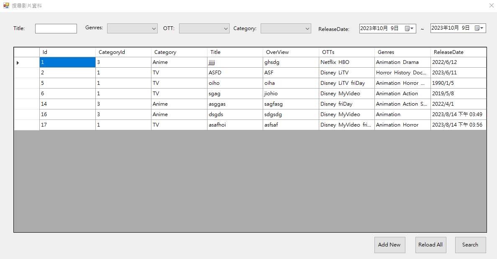

# WinForm版本影片維護系統

## 程式語言

**C#**

## 程式架構

**三層式架構**

## 功能

**實現CRUD功能，包括新增、查詢、修改、刪除**

## 開發工具

**Visual Studio 2022**

## 開發環境

**WinForm (.Net Framework)**

## 專案概要

**旨在提供影片資訊的維護和管理功能。該系統實現了基本的CRUD操作，包括新增影片資訊、查詢現有資料、修改資料內容以及刪除不需要的資料。存取資料庫部分使用了Dapper、ADO.NET，並在程式中使用了三層式架構。這個專案展示了對於WinForm應用程式開發的熟練掌握，以及對於資料庫操作和使用者介面設計的技術能力。**

